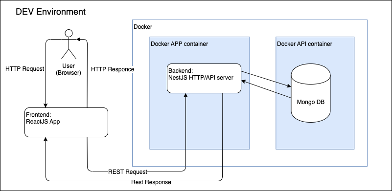
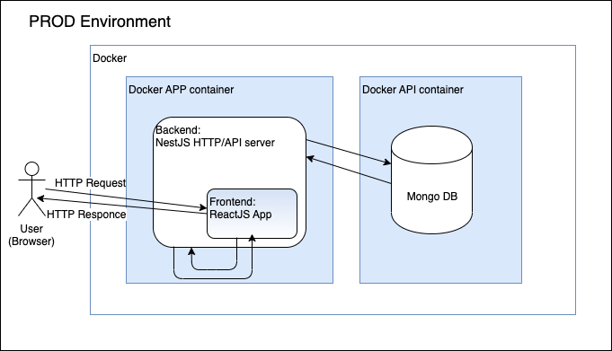

## Description
This is a test task for AppReal

## Documentation
The general overview of the project.

It's possible to run the application in docker containers. One container is used for running the app (frontend and backend parts). Here we use ReactJS as a frontend part server by link [http://localhost:3000/](http://localhost:3000/)
The backend part uses [NextJS](https://github.com/nestjs/) for HTTP-server and API. It's running on a different port [http://localhost:3001/](http://localhost:3001/)](http://localhost:3001/)

In the second container, we serve the MongoDB server to store the application data.
For the development, we have to run two apps separately for the client and backend to serve live updates and hot reloading
<p align="center">
  <a href="#" target="blank"></a>
</p>

For the production, in contrast, we don't need to run a separate HTTP server for the client since it can be done by the [ServeStaticModule](https://docs.nestjs.com/recipes/serve-static#serve-static) of NestJS. So it can return Single Page Application written on React and then it calls the API to get the data, authorization, etc.
<p align="center">
  <a href="#" target="blank"></a>
</p>

The documentation is made in the online editor: https://www.diagrameditor.com/

# Getting Started with app-real-test
We use mono repo with workspaces. The [Turborepo](https://turbo.build/repo/docs) is responsible for starting the app for the demonstration and development.

## Installation
The app requires some libs to be installed locally:
- Install NodeJS v16.13+ https://nodejs.org/en/download/
- Install Docker v18.06+ https://docs.docker.com/desktop/

```bash
$ npm install
```

## Running the app
Mainly the app should run in the Docker containers. However, in the dev mode, the client part still runs locally.
```bash
# development
$ npm run start
```
```bash
# watch mode
$ npm run start:dev
```
```bash
# debug mode
$ npm run start:debug
```

-The client: http://localhost:3000 in the browser
-The API: http://localhost:3001/ 
-The Swagger: The API: http://localhost:3001/api/

In case you want to run the app locally, use the following commands. Please keep in mind that the MongoDB server will be run in the docker container thought. This approach is preferable for debugging both the client end server.
```bash
# development
$ npm run start:local
```
```bash
# watch mode
$ npm run start:local:dev
```
```bash
# debug mode
$ npm run start:local:debug
```
Use "Debug NestJS locally" item in the Debug section of Visual Studio (listened in the launch.json file). 

## Run tests
To run Unit tests both for the Frontend end Backend use the following command:
```bash
$ npm test
```

## TODO:
- add support for gRPC API
- write UI test to have 100% coverage
- user OpenAPI generated by swagger to generate API model for the react part

## Useful links:
- https://wanago.io/2021/08/16/api-nestjs-mongodb/ - best examples!
- https://docs.nestjs.com/fundamentals/
- https://create-react-app.dev/docs
- https://www.youtube.com/watch?v=nY0R7pslbCI&

## Stay in touch
- Author - [Vitalii Bratko]()